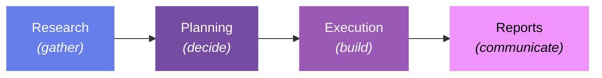
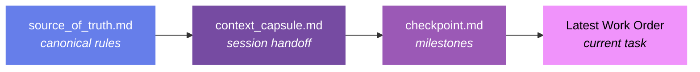
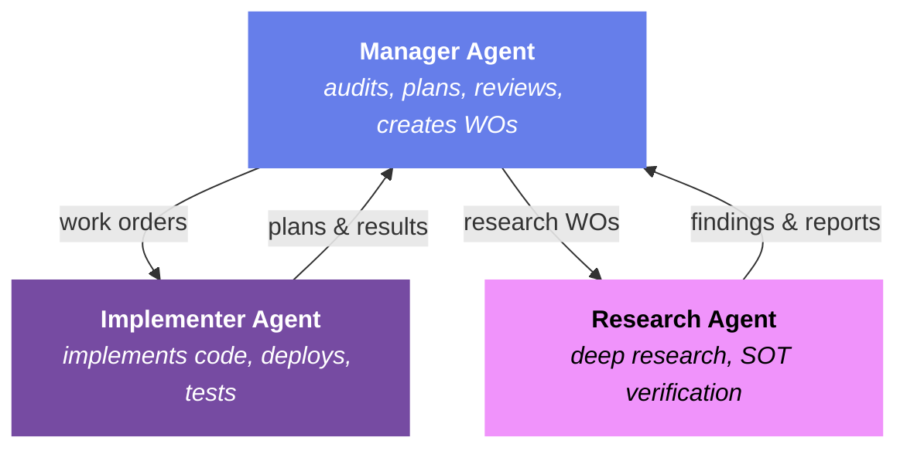
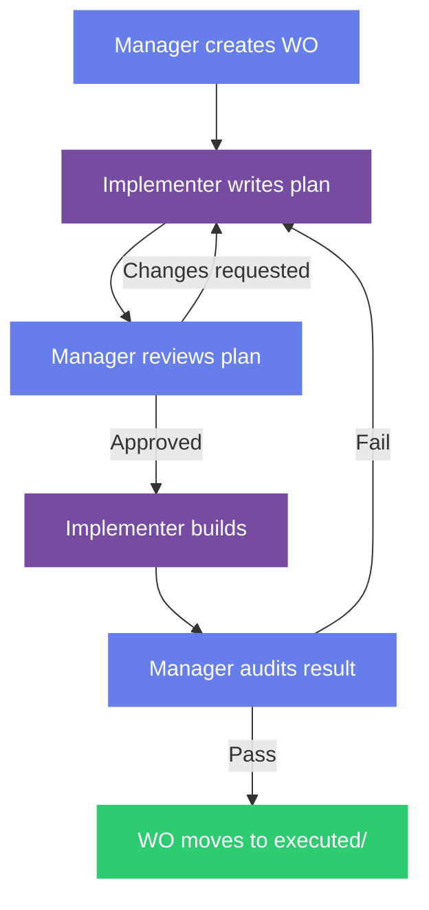

<div align="center">

# Praxis (πρᾶξις)

**The practice of doing** — a filesystem-based methodology for agentic development.

From the Greek *πράσσω (prássō)* — "to do, to act, to practice."

[](https://github.com/luisfaxas/praxis)
[](LICENSE)
[](#provider-integration)

*Zero dependencies. Just folders and markdown.*

</div>

---

In philosophy, Aristotle coined the modern usage of *praxis* to mean **the process by which theory becomes practice.** It is the bridge between knowing and doing — you have theory (*theōría* / θεωρία) on one side, and *praxis* on the other, where knowledge is enacted through deliberate action.

That is exactly what this methodology does. It bridges the gap between what AI agents *know* (their training, their context window, their capabilities) and what they *do* (writing code, researching, auditing, reporting) — through structured context, persistent memory, and traceable work.

---

## The Problem

AI agents are powerful but forgetful. Every new session starts from zero. The context window is a blank slate — yesterday's decisions, last week's architecture choices, the reason you picked PostgreSQL over MySQL — all gone unless someone writes it down.

Most people solve this by writing longer prompts. They paste project context, repeat instructions, hope the AI remembers what matters. This works for small tasks. It collapses for anything real.

**The problems with prompt-driven development:**

- **Ephemeral** — prompts disappear when the session ends. No audit trail, no history.
- **Unstructured** — instructions are scattered across chat messages. Nothing is canonical.
- **Untrackable** — there's no concept of "done." Did the AI complete the task? Partially? Who checks?
- **Single-agent** — prompts assume one AI. When multiple agents collaborate, there's no routing, no ownership, no handoff protocol.
- **Human memory-dependent** — the developer must remember what happened last session and re-explain it. Both humans and AI have short-term memory limitations.

Praxis solves all of this with a filesystem. No database. No SaaS platform. Just folders and markdown.

---

## Work Orders: The Core Innovation

The most important concept in Praxis is the **work order** — and it comes from an unexpected place.

### Origin: Construction & Manufacturing

In construction, a *work order* is a formal document that authorizes and describes a specific piece of work. It has a scope, acceptance criteria, an assigned worker, and a clear definition of "done." When the electrician finishes wiring the second floor, the work order moves from "pending" to "complete." There's a paper trail. There's accountability. There's no ambiguity about what was asked or what was delivered.

Software engineering adopted a similar concept with tickets and issues — Jira, GitHub Issues, Linear. But these tools assume a human developer who reads the ticket, carries context in their head across sessions, and reports back.

**AI agents don't work like that.** They start fresh every session. They can't check Jira. They don't remember yesterday.

### Work Orders for AI Agents

Praxis brings the work order pattern into AI development:

```markdown
# Work Order: Implement Authentication Middleware

- **WO#:** 3
- **Date Created:** 2026-02-20
- **Status:** Pending
- **Assigned To:** Claude
- **Priority:** High

## Description
Add JWT-based authentication middleware to all /api routes.

## Acceptance Criteria
- [ ] Middleware validates JWT tokens on every /api/* route
- [ ] Invalid tokens return 401 with consistent error format
- [ ] Token refresh endpoint exists at /api/auth/refresh
```

This file lives in `dev/work-orders/`. The AI reads it at session start. The AI works against the acceptance criteria. When done, the work order moves to `executed/`. There is no ambiguity.

### Why Work Orders Beat Prompts

| | Prompts | Work Orders |
|--|---------|-------------|
| **Persistence** | Die with the session | Live as files — survive forever |
| **Scope** | Vague, conversational | Defined acceptance criteria |
| **Tracking** | "Did I ask for that?" | Pending → Executed pipeline |
| **Routing** | One agent, one prompt | Routable to specific agents |
| **Audit trail** | None | The file IS the trail |
| **Decomposition** | Mega-prompts that grow forever | Master plan → incremental WOs |
| **Multi-session** | Re-explain everything each time | AI reads the WO fresh — no drift |

The work order is to AI development what the shipping container was to global trade — a standardized unit that any agent can pick up, process, and deliver.

---

## The Development Lifecycle

Praxis organizes all work into a four-stage pipeline:



| Stage | Folder | What Happens Here |
|-------|--------|-------------------|
| **Research** | `dev/research/` | Gather information before making decisions. Compare options, benchmark alternatives, read documentation. |
| **Planning** | `dev/planning/` | Make decisions. Write master plans (draft → approved). Architectural choices live here. |
| **Execution** | `dev/work-orders/`, `dev/commands/` | Build. Work orders track tasks. Command docs deliver operator scripts. |
| **Reports** | `dev/reports/` | Communicate results to stakeholders. Draft → published pipeline. |

Every folder in `dev/` maps to one of these stages. When you open a Praxis project, you immediately know where everything is and why it's there.

### Cross-Cutting Concerns

| Folder | Purpose |
|--------|---------|
| `dev/audit/` | Quality trail — architecture audits, conformance checks, drift reports |
| `dev/design/` | Design assets — tokens, brand guidelines, visual audit captures |
| `dev/archive/` | Historical records — retired documents with manifests |

---

## The Context Chain

Praxis solves AI amnesia with three living documents that persist across every session:



| Document | What It Contains | Updated When |
|----------|-----------------|--------------|
| **source_of_truth.md** | Project rules, decisions log, tech stack, folder structure. The canonical record. If anything conflicts, this file wins. | When decisions are made |
| **context_capsule.md** | Last session's summary: what was done, what's next, active task status. This is the "handoff note" between sessions. | Every session end |
| **checkpoint.md** | Completed milestones with dates. The progress record. | When work is completed |

**The read order at every session start:**

1. `source_of_truth.md` — What are the rules?
2. `context_capsule.md` — What happened last time?
3. `checkpoint.md` — What's been accomplished?
4. Latest work order — What should I work on now?

**The write order at every session end:**

1. Update `source_of_truth.md` — Any new decisions?
2. Update `context_capsule.md` — What did I do? What's next?
3. Update `checkpoint.md` — Any milestones completed?

This is the heartbeat of Praxis. It turns stateless AI sessions into a continuous, traceable development process.

---

## The Triangle Pattern

Praxis supports two operational modes:

### Solo Mode (Default)

One AI agent operates independently. Work orders are a flat queue:

```
work-orders/
├── 1_2026-02-20_AUTH_MIDDLEWARE.md     (pending)
├── 2_2026-02-20_API_VALIDATION.md     (pending)
└── executed/
    └── 0_2026-02-19_PROJECT_SETUP.md  (done)
```

### Triangle Mode (Multi-Agent)

Three specialized AI agents collaborate, each with a distinct role:



| Role | Responsibility | Reads From | Writes To |
|------|---------------|-----------|-----------|
| **Manager** | Audits, plans, reviews, creates WOs | Full project | `work-orders/wo_{agent}/`, `audit/` |
| **Implementer** | Implements code, deploys, tests | Its assigned WOs | Source code, `commands/`, completed WOs |
| **Researcher** | Deep research, SOT verification, codebase indexing | Its assigned WOs | `research/active/`, `audit/` (drift reports) |

> **Example assignment:** Codex CLI as Manager, Claude Code as Implementer, Gemini CLI as Researcher. But any AI that can read and write files can fill any role.

Work orders are routed to agent-specific folders:

```
work-orders/
├── wo_implementer/
│   ├── 3_2026-02-20_AUTH_MIDDLEWARE.md
│   └── executed/
├── wo_manager/
│   └── executed/
└── wo_researcher/
    ├── 1_2026-02-20_JWT_LIBRARY_RESEARCH.md
    └── executed/
```

<details>
<summary><b>The Reflection Pattern</b> — the core loop in Triangle mode (click to expand)</summary>



**Why this works:** The Manager sees the full picture (discovery audit + all WOs + all plans). The Implementer sees only its current WO. This separation prevents scope creep and ensures every implementation aligns with the overall project plan.

</details>

**Detection:** Triangle mode activates when multiple provider init files exist in `dev/init/` (e.g., `CODEX_INIT.md`, `GEMINI_INIT.md` alongside `CLAUDE_INIT.md`). Otherwise, Solo mode is the default.

---

## The dev/ Folder

<details>
<summary><b>Full folder structure</b> (click to expand)</summary>

```
dev/
├── source_of_truth.md              # Canonical rules and decisions
├── context_capsule.md              # Session handoff
├── checkpoint.md                   # Progress milestones
│
├── init/                           # Methodology reference docs
│   ├── DEV_STACK_INIT.md           # Provider-agnostic init
│   ├── CLAUDE_INIT.md              # Claude Code init
│   ├── CODEX_INIT.md               # Codex manager init (Triangle)
│   └── GEMINI_INIT.md              # Gemini researcher init (Triangle)
│
├── research/                       # Stage 1: GATHER
│   ├── active/                     # Research for current decisions
│   └── archive/                    # Decisions made, kept for reference
│
├── planning/                       # Stage 2: DECIDE
│   └── master-plan/
│       ├── draft/                  # Working plans (AI writes here)
│       └── approved/               # Finalized plans (admin promotes)
│
├── work-orders/                    # Stage 3: EXECUTE
│   └── executed/                   # Completed work orders
│
├── commands/                       # Operator command delivery
│   ├── active/                     # Command sets in topic subfolders
│   └── executed/                   # Completed command sets
│
├── audit/                          # Quality + conformance trail
│   ├── current/                    # Active audit entries
│   └── legacy/                     # Archived entries
│
├── reports/                        # Stage 4: COMMUNICATE
│   ├── draft/
│   │   ├── html/                   # Draft HTML reports
│   │   └── written/                # Draft written reports
│   └── published/
│       ├── html/                   # Final HTML (admin promotes)
│       └── written/                # Final written (admin promotes)
│
├── design/                         # Design assets
│   ├── audit/screenshots/          # Visual captures
│   ├── language/                   # Design tokens + methodology docs
│   └── resources/                  # Icons, fonts, logos
│
├── private/                        # Sensitive docs (GITIGNORED)
│
└── archive/                        # Historical records
    └── {date}_{description}/       # Dated batches with manifests
```

</details>

---

## Provider Integration

Praxis is **provider-agnostic**. It works with any AI assistant that can read and write files.

The methodology does NOT control how provider config files are created. Each provider creates their config per their own conventions:

| Provider | Config File | Init File |
|----------|------------|-----------|
| Claude Code | `CLAUDE.md` | `dev/init/CLAUDE_INIT.md` |
| Codex CLI | `AGENTS.md` | `dev/init/CODEX_INIT.md` |
| Gemini CLI | `GEMINI.md` | `dev/init/GEMINI_INIT.md` |
| Any other | Whatever the provider uses | `dev/init/DEV_STACK_INIT.md` |

During initialization, Praxis **injects** a small context handoff block into the provider's existing config — augmenting it, never replacing it. This ensures the AI knows where to find the context chain on every new session.

---

## Quick Start

### 1. Scaffold the dev/ folder

**Starter** (context chain + work orders only):

```bash
mkdir -p dev/work-orders/executed
```

Then create `dev/source_of_truth.md`, `dev/context_capsule.md`, and `dev/checkpoint.md`.

**Full** (complete governance layer):

```bash
mkdir -p dev/{init,research/{active,archive},planning/master-plan/{draft,approved},work-orders/executed,commands/{active,executed},audit/{current,legacy},reports/{draft/{html,written},published/{html,written}},design/{audit/screenshots,language,resources},archive}
```

### 2. Initialize context documents

Copy the templates for `source_of_truth.md`, `context_capsule.md`, and `checkpoint.md` from this repo's `dev/` folder into your project's `dev/` folder.

### 3. Copy the init file for your provider

Copy the relevant init file from `dev/init/` into your project. For Claude Code:

```bash
cp dev/init/CLAUDE_INIT.md your-project/dev/init/
```

### 4. Run init

Paste the contents of your provider's init file into a new session. The AI will:
- Read your codebase
- Populate the context documents
- Inject the context handoff into your provider config
- Perform an architecture audit (if existing code)
- Create Batch 0 work orders (critical issues only)

You're now running Praxis.

---

## Operating Rules

1. **Non-destructive** — AI never SSH's to production. Local copies only.
2. **Self-contained** — Every project gets its own `dev/` folder. Deployable as-is.
3. **No workspace root files** — All output goes into project folders or the dev/ structure.
4. **Draft/published wall** — AI writes to `draft/`. Admin promotes to `published/`.
5. **Executed means done** — Items stay pending until fully complete. No premature moves.
6. **Naming convention** — `{number}_{YYYY-MM-DD}_{DESCRIPTION}.{ext}`. Number 0 = READMEs.
7. **Commands in files, not chat** — AI never pastes multiline commands in conversation. Write to `commands/active/` and reference the path.
8. **Context updated every session** — Source of truth (decisions), capsule (summary), checkpoint (milestones).
9. **No secrets in dev/** — Never store API keys, passwords, tokens, or credentials in the `dev/` folder. Use `.env` files (gitignored) for secrets. Redact sensitive data in reports before promotion.

---

## Security & Sensitive Data

Praxis is designed to live in Git repositories. These rules prevent accidental exposure:

- **Never commit secrets.** API keys, passwords, tokens, and credentials belong in `.env` files, not in `dev/` documents.
- **Redact before publishing.** Reports in `draft/` may reference internal IPs, usernames, or infrastructure details. Redact before promoting to `published/`.
- **The `.gitignore` matters.** Praxis ships with a `.gitignore` that excludes common secret patterns. Extend it for your project.
- **Sensitive artifacts go in `dev/private/`.** Use it for contracts, credential references, internal notes with PII, or any document that should exist in the project context but never in version control. Add `dev/private/` to your project's `.gitignore`. Reference private docs from the source of truth by path (e.g., "credentials in `dev/private/server_creds.md`").
- **Command documents deserve extra scrutiny.** Command docs in `commands/active/` may contain connection strings, server addresses, or credentials. Review before committing to git.

---

## Adoption Tiers

You don't have to use everything on day one. Start small and add structure as complexity grows.

### Starter — Context Chain + Work Orders

The minimum viable Praxis. Just 3 files and 1 folder:

```
dev/
├── source_of_truth.md
├── context_capsule.md
├── checkpoint.md
└── work-orders/
    └── executed/
```

**Best for:** Solo developers, small projects, quick experiments. You get session continuity and task tracking with near-zero overhead.

### Standard — Add Research & Planning Pipeline

The full development lifecycle without the audit/report infrastructure:

```
dev/
├── source_of_truth.md, context_capsule.md, checkpoint.md
├── research/{active, archive}/
├── planning/master-plan/{draft, approved}/
├── work-orders/executed/
└── commands/{active, executed}/
```

**Best for:** Medium projects, multi-session work, projects that need planning before building.

### Full — Complete Governance Layer

Everything. Audit trail, report pipeline, design assets, archive:

```
dev/
├── (all Standard folders)
├── audit/{current, legacy}/
├── reports/draft/{html, written}/, published/{html, written}/
├── design/{audit/screenshots, language, resources}/
└── archive/
```

**Best for:** Multi-agent workflows, enterprise projects, long-running builds, projects with stakeholder reporting.

---

## File Naming Convention

All files follow: `{number}_{YYYY-MM-DD}_{DESCRIPTION}.{ext}`

- **Number** — Sequential, chronological (0, 1, 2, ...)
- **Date** — Creation date in ISO format
- **Description** — UPPERCASE, underscore-separated
- **Number 0** is reserved for READMEs and examples

```
1_2026-02-20_AUTH_MIDDLEWARE.md
2_2026-02-20_API_VALIDATION.md
0_2026-02-20_README.md
```

---

## Validation (praxis-lint)

Praxis includes an automated validation tool that checks whether your `dev/` folder conforms to the methodology. It transforms Praxis from convention-based (rules you follow voluntarily) to convention-enforced (rules that are verified automatically).

### Quick Start

```bash
bash tools/praxis-lint.sh              # Lint current project
bash tools/praxis-lint.sh --fix        # Auto-create missing directories
bash tools/praxis-lint.sh --json       # JSON output for hooks/CI
bash tools/praxis-lint.sh --strict     # Warnings become failures
bash tools/praxis-lint.sh --help       # Full usage information
```

### What It Checks (7 Categories, 50 Checks)

| Category | What | Key Checks |
|----------|------|------------|
| **Structure** | Required folders exist for your tier | `dev/`, core docs, work-orders/, research/, etc. |
| **Context Freshness** | Handoff docs aren't stale | capsule < 7 days, checkpoint < 30 days |
| **Work Orders** | Executed WOs are truly complete | No unchecked `- [ ]` boxes in executed/ |
| **Naming** | Files follow the convention | `{number}_{YYYY-MM-DD}_{DESC}.ext` |
| **Security** | No secrets in tracked files | Private keys, AWS keys, connection strings |
| **SOT Consistency** | Source of Truth matches reality | Referenced folders exist, decisions logged |
| **Orphans** | No files in wrong locations | No loose files at dev/ root |

### Exit Codes

| Code | Meaning | CI/CD Effect |
|------|---------|-------------|
| `0` | All pass (or INFO-only) | Pipeline passes |
| `1` | Warnings found (drifting) | Pipeline passes (or fails with `--strict`) |
| `2` | Failures found (broken) | Pipeline fails |

### Integration

praxis-lint integrates with both CI/CD pipelines and AI coding assistants:

| Integration | How | Setup |
|-------------|-----|-------|
| **Claude Code** | SessionStart hook — runs automatically, feeds findings to AI | See `tools/examples/settings-hook.json` |
| **GitHub Actions** | CI workflow — blocks PRs with failures | See `tools/examples/github-action.yml` |
| **Pre-commit hook** | Git hook — validates before every commit | Copy hook script to `.git/hooks/pre-commit` |
| **Any AI agent** | Init file instruction — AI runs linter as first action | Referenced in `dev/init/*_INIT.md` |
| **Manual** | Run from terminal anytime | `bash tools/praxis-lint.sh` |

**Works with gitignored dev/:** The linter reads the local filesystem, not git. If `dev/` is gitignored, local modes (manual, hooks, AI) all work. CI gracefully skips.

Zero dependencies. One file. Works on any Unix system.

---

## Why Filesystem?

Praxis deliberately uses the filesystem instead of a database, API, or SaaS platform:

- **Zero dependencies** — Works anywhere there's a file system. No installs, no accounts, no subscriptions.
- **Git-friendly** — The `dev/` folder can be tracked (or gitignored for private projects). Full version history for free.
- **AI-native** — Every AI agent can read and write files. Not every AI agent can call APIs or query databases.
- **Human-readable** — Open any file in any text editor. No special tools needed to understand the project state.
- **Portable** — Copy the `dev/` folder to a new machine, a new project, a new team. It just works.
- **Transparent** — No hidden state. Everything is visible, auditable, and diffable.

---

## Origin Story

Praxis is the culmination of thousands of hours working alongside the most capable agentic LLMs available — Claude Opus 4.6, GPT-5.2, Gemini with its 2M-token context window — pushing them to their limits on real projects. Not toy demos. Not tutorial apps. Real infrastructure builds, real web applications, real multi-agent workflows where mistakes cost hours and context loss costs days.

But the methodology didn't come from AI alone. It came from an unexpected place: **property management.**

Years of managing construction projects, coordinating contractors, tracking work orders across multiple sites, and maintaining audit trails for compliance — that operational experience is baked into every part of Praxis. The work order pattern? That's how construction has tracked tasks for decades. The draft/published wall? That's how property managers handle lease documents — drafts are internal, published documents go to tenants. The context chain? That's the handoff note you leave for the next shift manager so nothing falls through the cracks.

The insight was simple: **AI agents have the same coordination problems as human teams.** They forget context between sessions. They don't know what other agents are working on. They lack a single source of truth. They can't verify whether a task was actually completed. These are solved problems in operations management — they just hadn't been applied to AI development yet.

Praxis bridges two worlds:
- **The organizational discipline** of real-world project management — work orders, audit trails, handoff protocols, quality gates
- **The technical capabilities** of modern AI agents — code generation, research, architecture analysis, multi-agent orchestration

The result is a methodology where humans and AI agents collaborate as equals, each compensating for the other's limitations. AI has unlimited patience and processing power but no persistent memory. Humans have institutional knowledge and decision authority but limited bandwidth. Praxis gives both sides a shared filesystem-based workspace where context persists, work is tracked, and nothing gets lost.

Every rule in this methodology exists because its absence caused a real problem on a real project. Nothing is theoretical. Everything is *praxis*.

---

## License

MIT License. See [LICENSE](LICENSE) for details.

The MIT License means you can freely use, modify, and distribute Praxis — including in commercial projects. The only requirement is including the copyright notice. This is the same license used by React, Next.js, and most major open-source developer tools.

---

<div align="center">

**Created by Luis Faxas, 2026.**

> *"The process by which theory becomes practice."*
> *— Aristotle, on πρᾶξις*

</div>
